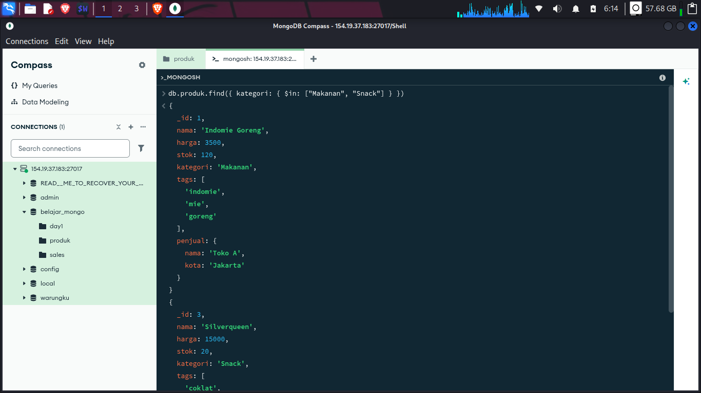
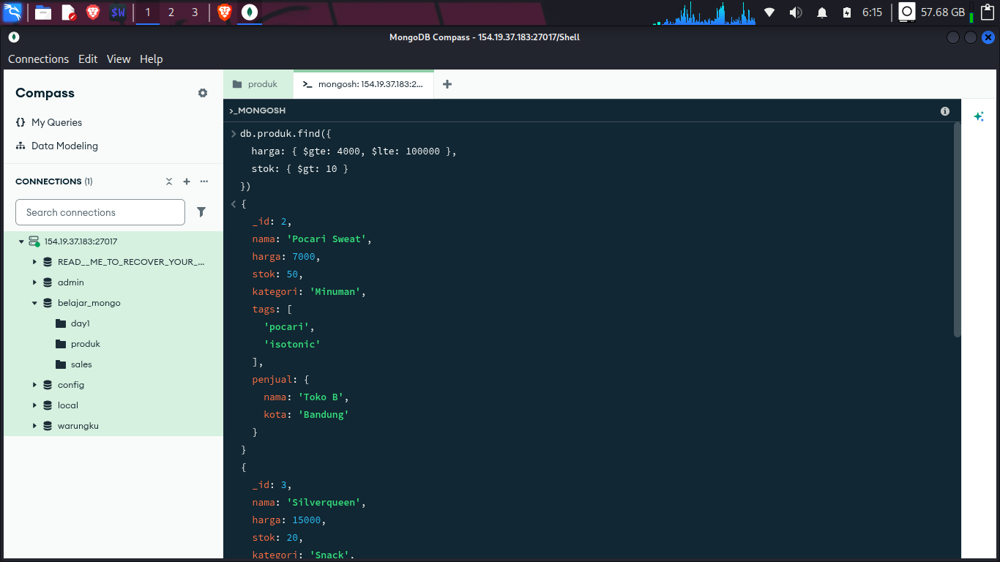
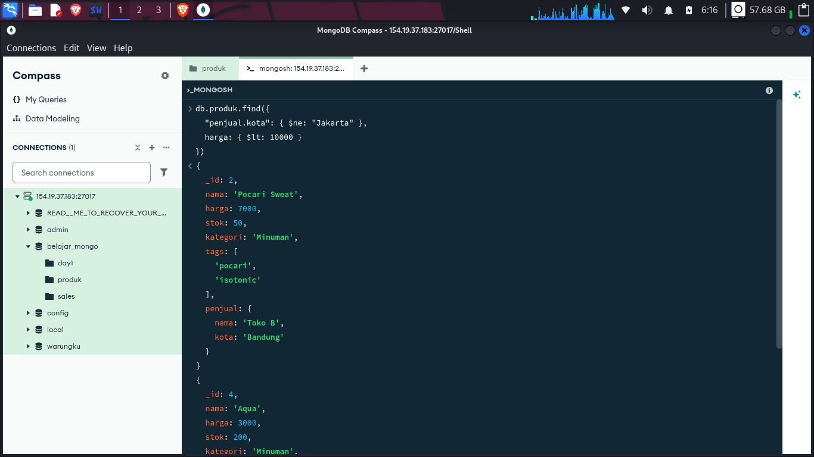
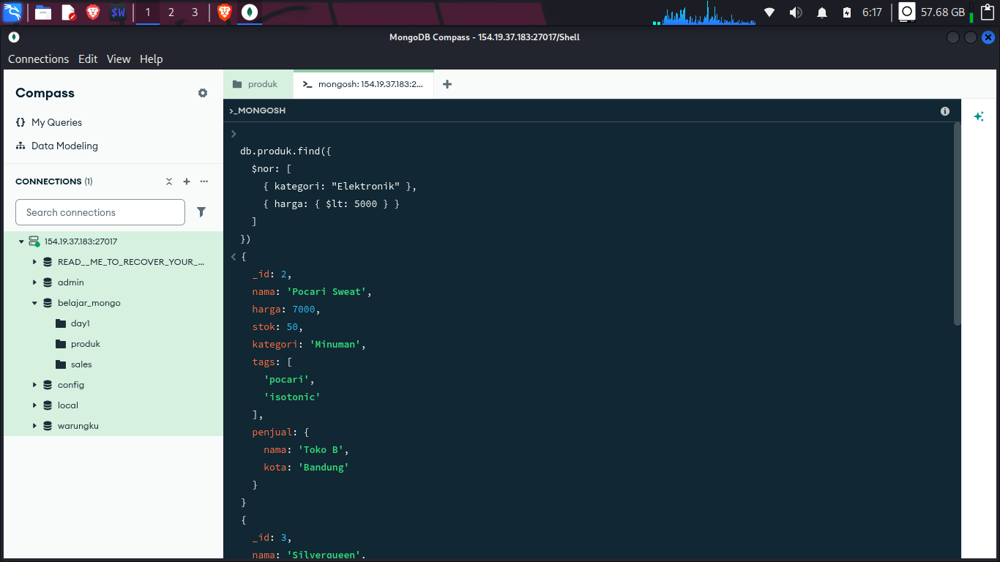
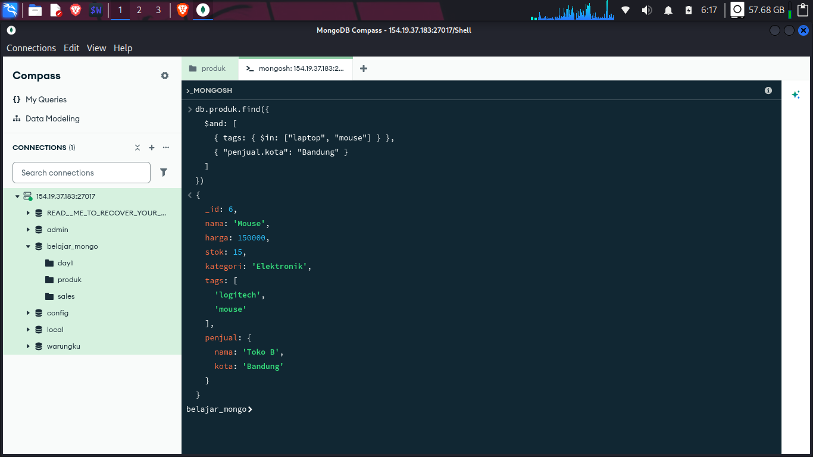
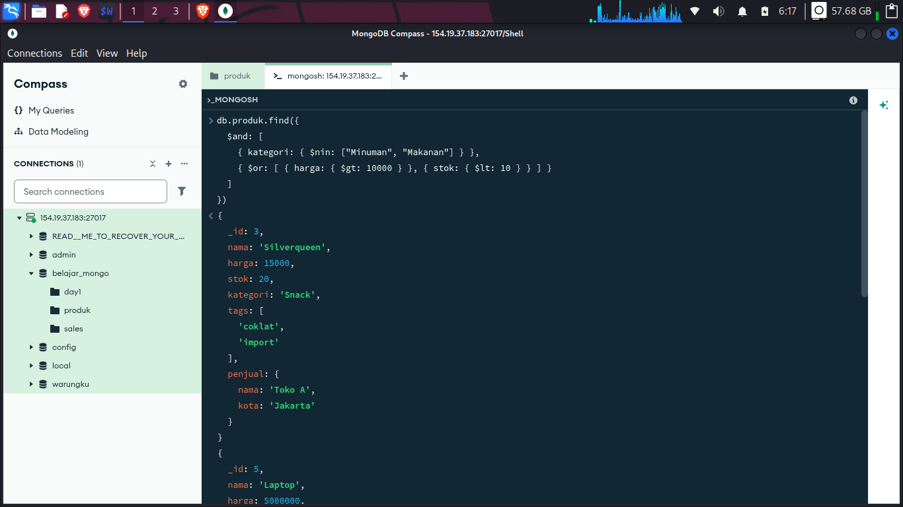
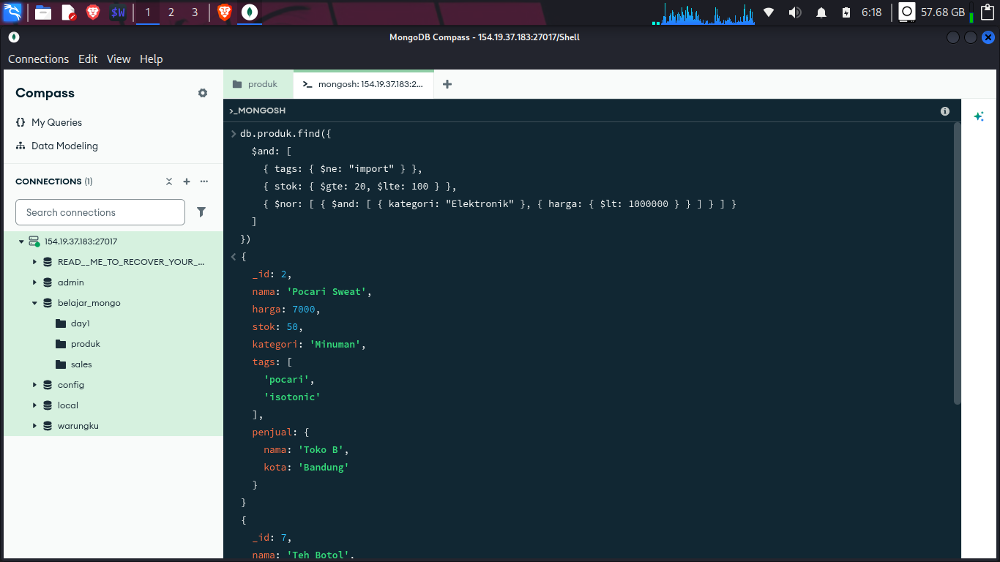

## 5. Latihan Soal + Pembahasan

Kita pakai dataset `produk` file yang ada di produk.json:
Disini saya meminta ai untuk membuat exercise hari pertama saya dengan kesusahan mudah-sulit/easy-hard

### Soal 1 

Cari produk kategori "Minuman" dan harga < 7000.

```javascript
db.produk.find({ kategori: "Minuman", harga: { $lt: 7000 } })
// Hasil: Aqua (3000), Teh Botol (5000)
```


### Soal 2

Cari produk kategori "Makanan" atau "Snack".

```javascript
db.produk.find({ kategori: { $in: ["Makanan", "Snack"] } })
// Hasil: Indomie, Silverqueen
```


### Soal 3 

Harga antara 4000-100000 dan stok > 10.

```javascript
db.produk.find({
  harga: { $gte: 4000, $lte: 100000 },
  stok: { $gt: 10 }
})
// Hasil: Pocari, Mouse, Teh Botol
```


### Soal 4

Bukan dari Jakarta dan harga < 10000.

```javascript
db.produk.find({
  "penjual.kota": { $ne: "Jakarta" },
  harga: { $lt: 10000 }
})
// Hasil: Pocari (Bandung), Aqua (Surabaya)
```


### Soal 5 

(Minuman atau harga >100000) dan stok <100.

```javascript
db.produk.find({
  $and: [
    { $or: [ { kategori: "Minuman" }, { harga: { $gt: 100000 } } ] },
    { stok: { $lt: 100 } }
  ]
})
// Hasil: Pocari, Mouse, Laptop, Teh Botol
```


### Soal 6 

Tidak memenuhi kedua: (kategori Elektronik) dan (harga <5000).

```javascript
db.produk.find({
  $nor: [
    { kategori: "Elektronik" },
    { harga: { $lt: 5000 } }
  ]
})
// Hasil: Pocari, Silverqueen, Teh Botol
```



### Soal 7 

Tags mengandung "laptop" atau "mouse", dan penjual dari Bandung.
```javascript
db.produk.find({
  $and: [
    { tags: { $in: ["laptop", "mouse"] } },
    { "penjual.kota": "Bandung" }
  ]
})
// Hasil: Mouse
```


### Soal 8 

Bukan Minuman & Bukan Makanan, tapi (harga >10000 atau stok <10).

```javascript
db.produk.find({
  $and: [
    { kategori: { $nin: ["Minuman", "Makanan"] } },
    { $or: [ { harga: { $gt: 10000 } }, { stok: { $lt: 10 } } ] }
  ]
})
// Hasil: Silverqueen, Laptop, Mouse
```


### Soal 9 

Nama mengandung "Teh" (case insensitive) atau harga <=5000, dan penjual bukan "Toko C".

```javascript
db.produk.find({
  $and: [
    { $or: [ { nama: /teh/i }, { harga: { $lte: 5000 } } ] },
    { "penjual.nama": { $ne: "Toko C" } }
  ]
})
// Hasil: Indomie, Teh Botol
```


### Soal 10 

Tidak punya tags "import", stok 20-100, kecuali (Elektronik dengan harga < 1jt).

```javascript
db.produk.find({
  $and: [
    { tags: { $ne: "import" } },
    { stok: { $gte: 20, $lte: 100 } },
    { $nor: [ { $and: [ { kategori: "Elektronik" }, { harga: { $lt: 1000000 } } ] } ] }
  ]
})
// Hasil: Pocari, Teh Botol
```


---

