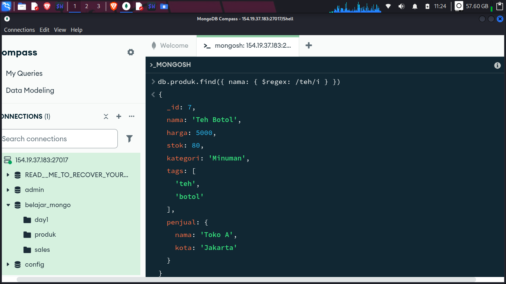
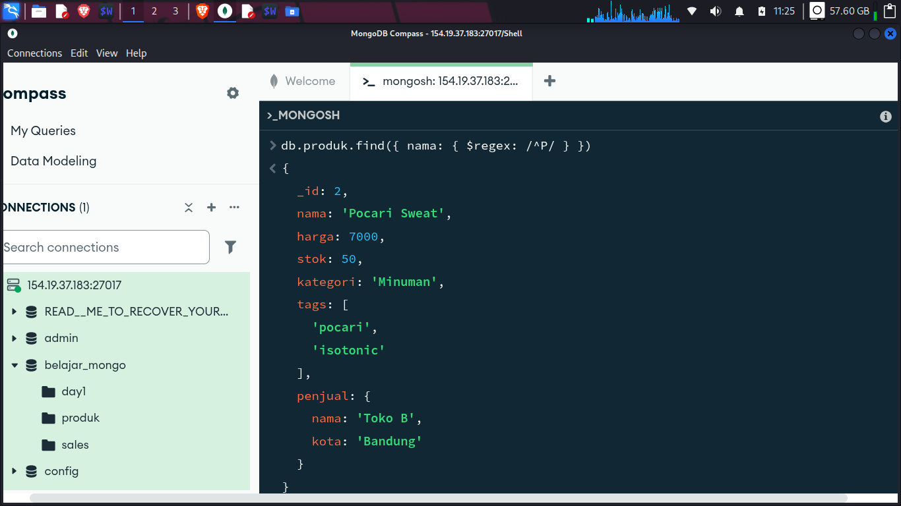
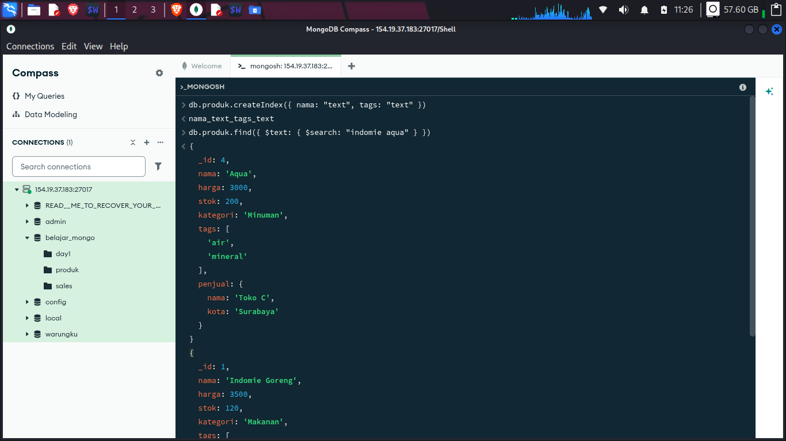
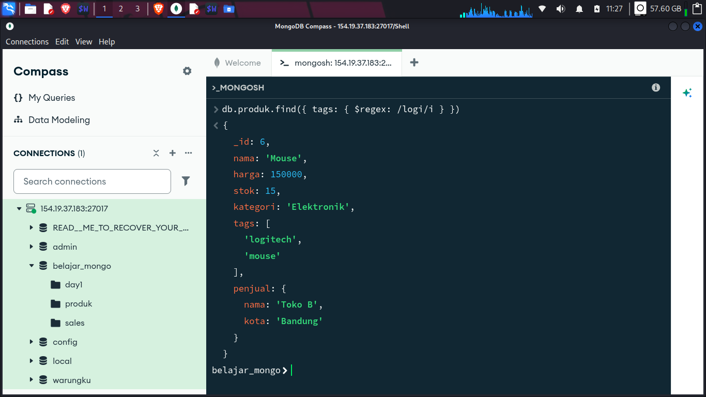
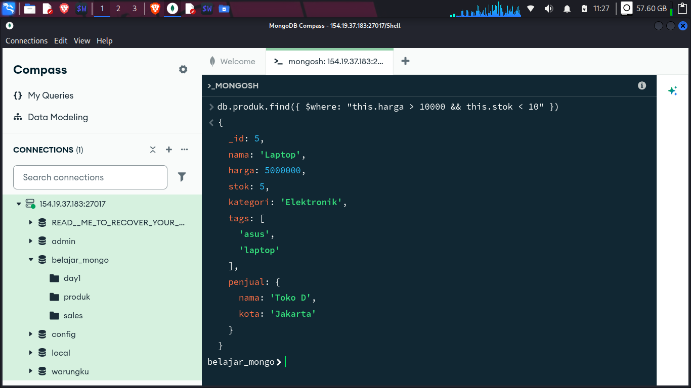

## Latihan Soal Evaluation Operators MongoDB

Dataset: `produk` (seperti di atas)

### Soal 1
Cari produk yang namanya mengandung kata "teh" (case insensitive).

**Jawaban:**
```javascript
db.produk.find({ nama: { $regex: /teh/i } })
```


---

### Soal 2
Cari produk yang namanya dimulai dengan huruf "P" (case sensitive).

**Jawaban:**
```javascript
db.produk.find({ nama: { $regex: /^P/ } })
```


---

### Soal 3
Buat text index pada field `nama` dan `tags`, lalu gunakan `$text` untuk mencari produk yang mengandung kata "indomie" atau "aqua".

**Jawaban:**
```javascript
// Buat index
db.produk.createIndex({ nama: "text", tags: "text" })

// Query
db.produk.find({ $text: { $search: "indomie aqua" } })
```


---

### Soal 4
Gunakan `$regex` untuk mencari produk yang memiliki tag yang mengandung kata "logi" (misal logitech).

**Jawaban:**
```javascript
db.produk.find({ tags: { $regex: /logi/i } })
```


---

### Soal 5 
Gunakan `$where` untuk mencari produk yang harganya lebih besar dari 10000 dan stoknya kurang dari 10.

**Jawaban:**
```javascript
db.produk.find({ $where: "this.harga > 10000 && this.stok < 10" })
```


