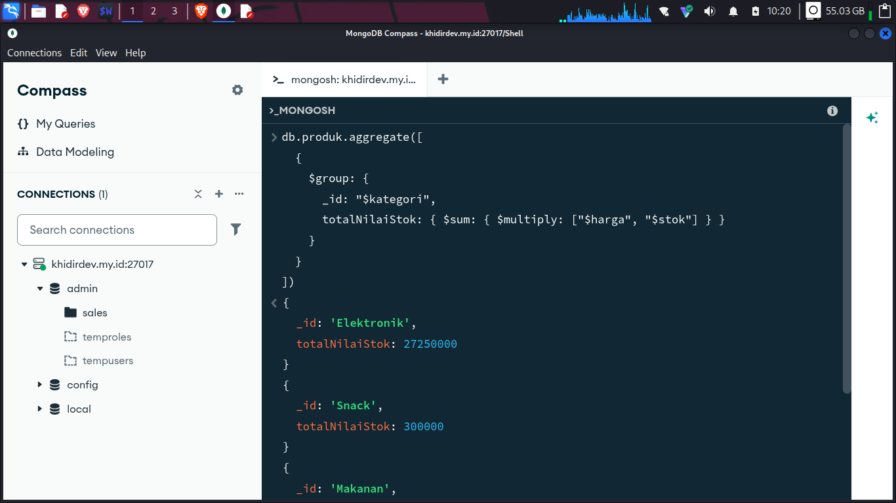
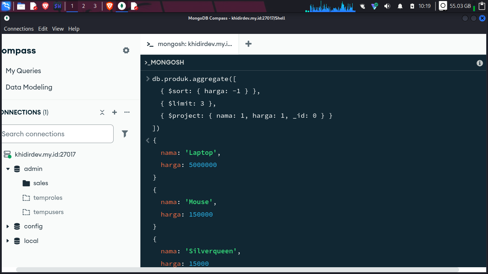
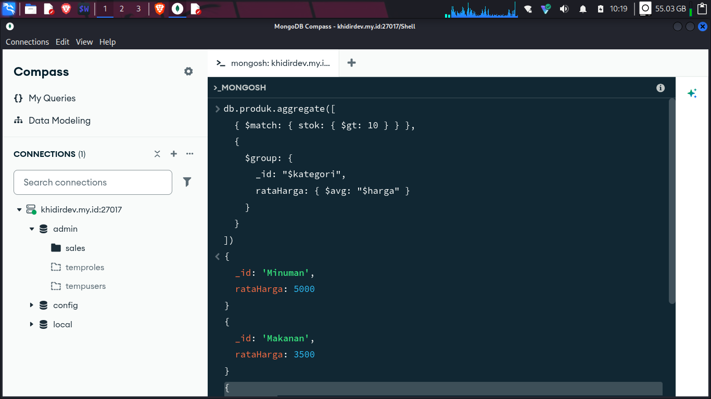

# 📘 Day 3: Aggregation Pipeline MongoDB

**Day 3** perjalanan belajar MongoDB. Hari ini belajar ke salah satu fitur: **Aggregation Pipeline**.

DAFTAR ISI:
- Apa itu aggregation pipeline dan kenapa lebih bagus daripada `find()`  
- Stage dasar: `$match` dan `$group`  
- Perbedaan `$match` (stage) dengan `$eq` (operator)  
- Operator akumulator (`$sum`, `$avg`, dll)  
- Contoh latihan 

---

## 🧠 Apa Itu Aggregation Pipeline?

Aggregation pipeline adalah **rangkaian tahap (stages)** yang memproses dokumen langkah demi langkah. Setiap stage melakukan satu tugas spesifik, misalnya menyaring (`$match`), mengelompokkan (`$group`), mengurutkan (`$sort`), atau mengubah struktur dokumen (`$project`).

---

## ⚡ `aggregate()` vs `find()`: Kapan Pakai yang Mana?

| Fitur               | `find()`                                    | `aggregate()`                                |
|---------------------|---------------------------------------------|----------------------------------------------|
| **Tujuan utama**    | Mencari dokumen sederhana                   | Analisis data, transformasi, agregasi       |
| **Filter**          | Ya, dengan query object                     | Ya, dengan `$match`                          |
| **Grouping**        | ❌ Tidak bisa                                | ✅ Bisa dengan `$group`                       |
| **Menghitung total/rata-rata** | ❌ Tidak bisa                | ✅ Bisa dengan akumulator (`$sum`, `$avg`, dll) |
| **Menggabungkan koleksi** | ❌ Tidak bisa                         | ✅ Bisa dengan `$lookup` (JOIN)               |
| **Transformasi field** | Hanya proyeksi sederhana                  | ✅ Bisa dengan `$project` (buat field baru, ubah tipe, dll) |
| **Performa**        | Cepat untuk query sederhana                 | Efisien untuk query kompleks karena proses di server |
| **Hasil**           | Dokumen mentah                               | Dokumen hasil olahan (bisa berbeda struktur) |

**Kesimpulan:**  
- Pakai `find()` kalau cuma butuh **mencari dokumen** dengan filter sederhana.  
- Pakai `aggregate()` kalau butuh **menganalisis, mengelompokkan, menghitung agregat, atau mengubah struktur data**.

---

## 🔍 Stage `$match` (Penyaringan)

`$match` berfungsi menyaring dokumen yang akan diproses di tahap berikutnya. Penulisan kriteria di `$match` **sama persis** dengan query di `find()`.

**Contoh:**
```javascript
db.produk.aggregate([
  { $match: { kategori: "Minuman" } }
])
```
Hanya mengembalikan produk dengan kategori "Minuman".

### 💡 Tips:
- Letakkan `$match` **di awal pipeline** agar data yang diproses di stage berikutnya lebih sedikit → **performa meningkat**.
- `$match` bisa memanfaatkan index, jadi usahakan kriteria filter menggunakan field yang sudah di-index.

---

## 🔬 Perbedaan `$match` (Stage) dengan `$eq` (Operator)

Ini sering membingungkan. Mari kita bedah:

|                      | `$match`                                    | `$eq`                                        |
|----------------------|---------------------------------------------|----------------------------------------------|
| **Kategori**         | Stage aggregation pipeline                  | Operator comparison (bisa dipakai di `find()` atau di dalam `$match`) |
| **Fungsi**           | Menyaring dokumen yang lolos ke stage berikutnya | Membandingkan dua nilai (sama dengan)        |
| **Penggunaan**       | Hanya di dalam `aggregate()`                | Di dalam query filter (`find`, `$match`, `$project`, dll) |
| **Contoh**           | `{ $match: { harga: 3500 } }`               | `{ harga: { $eq: 3500 } }` (sama dengan `{ harga: 3500 }`) |

**Jadi:**  
- `$match` adalah **gerbang penyaring**.  
- `$eq` adalah **alat pembanding** yang bisa dipasang di dalam gerbang itu.

Di aggregation, `$eq` juga bisa dipakai di ekspresi lain, misal di `$project` untuk membuat field boolean:
```javascript
db.produk.aggregate([
  {
    $project: {
      nama: 1,
      isMurah: { $eq: ["$harga", 3500] }
    }
  }
])
```

---

## 📊 Stage `$group` (Pengelompokan)

`$group` digunakan untuk mengelompokkan dokumen berdasarkan field tertentu dan menghitung nilai agregat (total, rata-rata, dll). Mirip `GROUP BY` di SQL.

**Struktur:**
```javascript
{
  $group: {
    _id: <expression>,          // field yang menjadi kunci grup
    fieldHasil1: { $akumulator: <expression> },
    fieldHasil2: { $akumulator: <expression> },
    ...
  }
}
```

### 🧮 Operator Akumulator (paling sering dipakai)

| Operator   | Fungsi                             | Contoh                                |
|------------|-------------------------------------|---------------------------------------|
| `$sum`     | Menjumlahkan nilai                  | `totalStok: { $sum: "$stok" }`        |
| `$avg`     | Rata-rata nilai                     | `rataHarga: { $avg: "$harga" }`       |
| `$min`     | Nilai terkecil                      | `hargaTerendah: { $min: "$harga" }`   |
| `$max`     | Nilai terbesar                      | `hargaTertinggi: { $max: "$harga" }`  |
| `$first`   | Nilai pertama dalam grup             | `produkPertama: { $first: "$nama" }`  |
| `$last`    | Nilai terakhir dalam grup            | `produkTerakhir: { $last: "$nama" }`  |
| `$push`    | Membuat array dari nilai-nilai field | `daftarProduk: { $push: "$nama" }`    |

**Contoh:** Hitung total stok dan rata-rata harga per kategori.
```javascript
db.produk.aggregate([
  {
    $group: {
      _id: "$kategori",
      totalStok: { $sum: "$stok" },
      rataHarga: { $avg: "$harga" },
      produk: { $push: "$nama" }
    }
  }
])
```

---

## 🧪 Exercise

### Soal 1: Hitung total nilai stok (`harga * stok`) per kategori.
```javascript
db.produk.aggregate([
  {
    $group: {
      _id: "$kategori",
      totalNilaiStok: { $sum: { $multiply: ["$harga", "$stok"] } }
    }
  }
])
```


**Penjelasan:** Gunakan `$multiply` di dalam `$sum` untuk mengalikan harga dan stok per dokumen, lalu menjumlahkannya per grup.

### Soal 2: Cari 3 produk termahal, tampilkan nama dan harga.
```javascript
db.produk.aggregate([
  { $sort: { harga: -1 } },
  { $limit: 3 },
  { $project: { nama: 1, harga: 1, _id: 0 } }
])
```


**Penjelasan:** Urutkan harga descending (`-1`), ambil 3 teratas, lalu proyeksi hanya field yang diminta.

### Soal 3: Group produk berdasarkan kategori, hitung rata-rata harga, tapi hanya untuk produk dengan stok > 10.
```javascript
db.produk.aggregate([
  { $match: { stok: { $gt: 10 } } },
  {
    $group: {
      _id: "$kategori",
      rataHarga: { $avg: "$harga" }
    }
  }
])
```


**Penjelasan:** Filter dulu produk dengan stok > 10, baru di-group.

### Soal 4 : Cari kategori yang punya produk dengan harga > 10000 lebih dari 1 macam.
```javascript
db.produk.aggregate([
  { $match: { harga: { $gt: 10000 } } },
  {
    $group: {
      _id: "$kategori",
      jumlahProdukMahal: { $sum: 1 }
    }
  },
  { $match: { jumlahProdukMahal: { $gt: 1 } } }
])
```


**Penjelasan:**  
1. Filter produk dengan harga > 10000.  
2. Group per kategori, hitung jumlah produk mahal.  
3. Filter lagi kategori yang punya jumlah > 1.

---

## 🚀 Tips Aggregation

- **Letakkan `$match` dan `$sort` di awal** — mereka bisa memanfaatkan index.
- **Batasi data secepat mungkin** dengan `$match` dan `$limit`.
- **Gunakan `{ allowDiskUse: true }`** jika pipeline memproses data besar (melebihi batas memori 100MB per stage).
- **Hindari `$unwind` jika tidak perlu** karena bisa menggandakan jumlah dokumen drastis.

---

## 💬 Kesimpulan

- **`aggregate()`** adalah senjata ampuh untuk analisis data di MongoDB.
- **`$match`** = penyaring; **`$eq`** = pembanding; keduanya sering dipakai bersama.
- **`$group`** + akumulator = kemampuan agregasi setara SQL GROUP BY.
